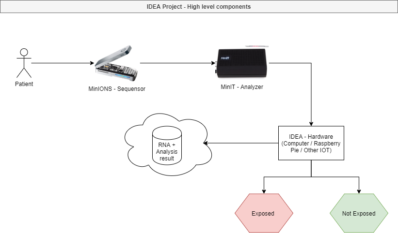

# IDEA

Real time RNA sequencing and analysis

## High level steps

- [ ] **Categorization** : Categorize the fastq data, probably need to create sub folders containing set of data. We can start with 2 folders one for broken RNA and one for normal RNA
- [ ] **Training** : Create a deep learning model based on those data
- [ ] **Build**: Build the model with tensorflow lite which will allows to move it to an IoT device (cf: Raspberry Pie)
- [ ] **Integration** : Integrate the RNA sequensor device with our IoT device, the purpose here is to gather the FASTQ file and analyze it
- [ ] **UI** : Create a nice UI to display the data. If we go with a binary answer (yes the RNA is broken, no it is not), we can think about use ligths (green , red) on our IoT device

## Contributing

- As Tensorflow + Jupyter notebook seems to be the standard way to deploy deep learning model, let's go with this toolset
- Multiple libraries already exists, as a beginner let's try to use the most known
    - [biopython](https://biopython.org/)
    - [tensorflow](https://www.tensorflow.org/)
    - [tensorflow-lite](https://www.tensorflow.org/lite)
    - [tensorflow-keras](https://www.tensorflow.org/guide/keras)
    - [pendas](https://pandas.pydata.org/)
    
**Note :** The biopython library offers simplicity to handle fastq files, however i don't know if we can build a tensorflow light model from this library. (Need to be investigated)

## RNA sequencing

https://store.nanoporetech.com/media/it-requirements-configure-minion-basic.pdf

## Architecture

[Full screen](https://www.draw.io/?lightbox=1&target=blank&highlight=0000ff&edit=_blank&layers=1&nav=1&title=architecture.drawio#Uhttps%3A%2F%2Fraw.githubusercontent.com%2Fangegar%2FIDEA%2Fmaster%2Farchitecture.drawio)

[Edit](https://www.draw.io/#Hangegar%2FIDEA%2Fmaster%2Farchitecture.drawio)
